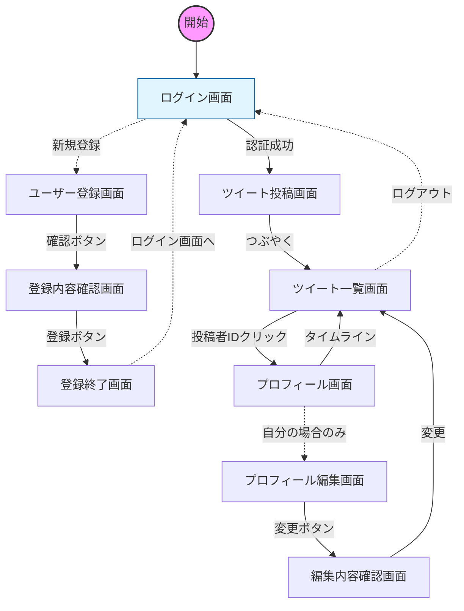
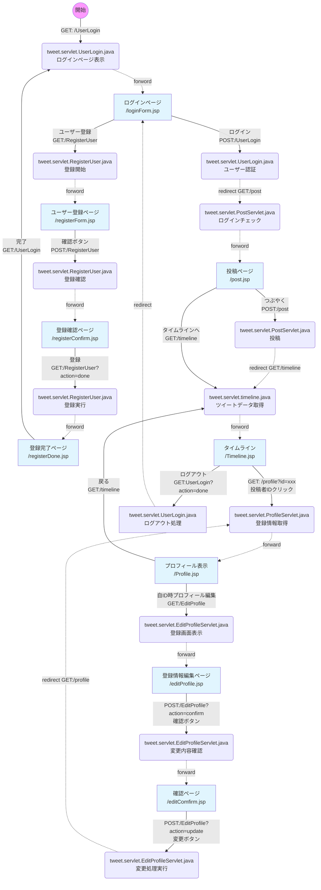

# 📍 場所情報付きつぶやきアプリ

Java / Servlet / JSP で作る、ログイン機能・地図機能付きのつぶやきアプリです。

---

## 機能一覧

- ユーザー登録 / ログイン / ログアウト
- つぶやきの投稿（テキスト＋地図で場所を選択）
- タイムライン表示（投稿者名リンク付き）
- 投稿者名をクリックしてプロフィールを表示
- 未ログイン時はすべてのページをログイン画面にリダイレクト

---

## 技術スタック

| 項目 | 内容 |
|---|---|
| サーバーサイド | Java / Jakarta Servlet / JSP |
| サーブレットコンテナ | Apache Tomcat 10.x |
| 地図ライブラリ | Leaflet.js 1.9.4 |
| 地図データ | OpenStreetMap（無料・APIキー不要） |
| ~~つぶやきデータ保存~~ | ~~XML ファイル（`WEB-INF/data/tweets.xml`）~~ |
| ~~ユーザーデータ保存~~ | ~~CSV ファイル（`WEB-INF/data/recordData.csv`）~~ |
| ~~CSV ライブラリ~~ | ~~opencsv 5.9~~ |
| SQL サーバー | H2 Database |
| JDBCドライバ | h2-2.3.240.jar |
| import パッケージ | `jakarta.servlet.*`（Tomcat 10 以降） |

---

## ファイル構成（JDBC版）

```
src/
└ tweet/
    ├── listener/
    │   └── AppInitListener.java  ← データベース初期化リスナー
    ├── model/
    │   ├── Tweet.java            ← つぶやきデータBean
    │   └── User.java             ← ユーザーデータBean
    ├── dao/
    │   ├── TweetDao.java         ← つぶやきDAOインタフェース
    │   ├── (XmlTweetDao.java      ← XML実装)
    │   ├── DBConfig.java          ← データベースのURLを持つクラス
    │   ├── jdbcTweetDao.java      ← jdbc版ツイートデータアクセスクラス
    │   ├── (UserDAO.java          ← ユーザーCSVアクセスクラス)
    │   └── jdbcUserDAO.java       ← jdbc版ユーザーデータアクセスクラス
    └── servlet/
        ├── PostServlet.java      ← つぶやき投稿
        ├── TimelineServlet.java  ← タイムライン表示
        ├── ProfileServlet.java   ← プロフィール表示
        ├── EditProfileServlet.java   ← プロフィール編集　追加
        ├── UserLogin.java        ← ログイン / ログアウト
        └── RegisterUser.java     ← ユーザー登録

WebContent/
├── post.jsp          ← 投稿フォーム（地図付き）
├── timeline.jsp      ← タイムライン
├── profile.jsp       ← プロフィール表示
└── WEB-INF/
    ├── jsp/
    │   ├── loginForm.jsp         ← ログインページ
    │   ├── registerForm.jsp      ← ユーザー登録ページ
    │   ├── registerConfirm.jsp   ← 登録確認ページ
    │   ├── registerDone.jsp      ← 登録完了ページ
    │   ├── editProfile.jsp       ← 登録情報編集ページ　　追加
    │   └── editComfirm.jsp       ← 編集確認ページ　　　　追加
（以下はjdbc版で不要）
    └── data/                     ← 手動で作成が必要
        ├── tweets.xml            （初回投稿時に自動生成）
        └── recordData.csv        （初回登録時に自動生成）
```

---

## セットアップ

### 前提条件

- JDK 17 以上
- Apache Tomcat 10.x
- ~~opencsv 5.9（`WEB-INF/lib/` に配置）~~
- データベースが接続済みであること
### 手順

1. リポジトリをクローン

```bash
git clone https://github.com/your-username/your-repo.git
```

2. `WEB-INF/data/` フォルダを手動で作成

```
WebContent/WEB-INF/data/
```

~~3. opencsv の jar を `WEB-INF/lib/` に配置~~
3. DbConfig.javaにデータベースのURLを記述

4. Tomcat にデプロイして起動

5. ブラウザで以下にアクセス

```
http://localhost:8080/{プロジェクト名}/UserLogin
```

---

## 画面遷移

```
[loginForm.jsp] → POST /UserLogin
    ↓ 認証成功
[PostServlet] doGet → post.jsp（投稿フォーム）
    ↓ POST /post
[PostServlet] doPost → dao.save()
    ↓ リダイレクト
[TimelineServlet] → timeline.jsp
    ↓ 投稿者名クリック
[ProfileServlet] → profile.jsp
```

---

---
詳細フロー

---

## セキュリティ対策

本アプリケーションでは、Webアプリケーションにおける主要な脆弱性に対して以下の対策を講じています。

### 1. 認証・セッション管理
* **アクセス制御**: 未ログイン状態で `/post`・`/timeline`・`/profile` 等の主要機能へ直接アクセスした場合、フィルターまたはサーブレットによりログイン画面へ強制リダイレクトします。
* **セッション固定攻撃 (Session Fixation) 対策**: 認証成功（ログイン時）に `request.changeSessionId()` を実行。既存のセッションIDを破棄し、新しいIDを再発行することで、第三者によるセッション乗っ取りを防止しています。
* **セッション管理**: `HttpSession` を利用し、サーバー側で安全にユーザーのログイン状態を保持しています。

### 2. リクエスト偽造・改ざん防止
* **CSRF (クロスサイト・リクエスト・フォージェリ) 対策**: 
    * ユーザー登録、プロフィール編集、ツイート投稿のすべての `POST` リクエストにおいて、UUIDによる**ワンタイムトークン**を生成・検証し、不正な第三者サイトからの操作を遮断しています。
    * トークンはセッションごとに管理され、更新処理が実行されるたびに検証・破棄される設計です。
* **PRG (Post-Redirect-Get) パターンの適用**: データの更新処理（POST）完了後は必ずリダイレクトを行うことで、ブラウザの「更新」ボタンによる**二重投稿や二重登録を防止**しています。

### 3. データ保護
* **SQLインジェクション対策**: すべてのDB操作（JDBC）において `PreparedStatement` を使用。静的プレースホルダによるバインド機構を利用し、SQLの構造とデータを完全に分離しています。
* **XSS (クロスサイト・スクリプティング) 対策**: ユーザー入力値をWebページに出力する際、JSTLの `<c:out>` や `escapeXML()` によるサニタイズを行い、悪意のあるスクリプトの実行を無効化しています。
* **パスワードの秘匿化**: データベースに保存するパスワードは `BCrypt` を用いてソルト付きハッシュ化を行い、万が一のデータ流出時にも生パスワードが露出しない設計としています。
---

## 注意事項

- ~~`WEB-INF/data/` フォルダは **手動で作成** が必要です。~~
- Tomcat 10 以降は `javax.servlet.*` ではなく `jakarta.servlet.*` を使用してください。
- ~~データ保存は XML / CSV ファイルのため、本番運用には適していません。将来的には `TweetDao` インタフェースと `UserDAO` クラスをそれぞれ JDBC 実装に差し替えることで SQL 移行が可能です。~~

---

## アップデート

- 2026-03-17:SQL データベース（H2 Database）への移行    
- 2026-03-18:パスワードのハッシュ化（BCrypt）
- 2026-03-19:ユーザー登録情報の編集機能追加、他
- 2026-03-20:セキュリティ対策（セッション固定攻撃対策、CSRF対策、PRGパターンの適用）の実装
---

## 将来の拡張案

- つぶやきの削除・編集機能
- ユーザーごとのタイムラインフィルタリング
